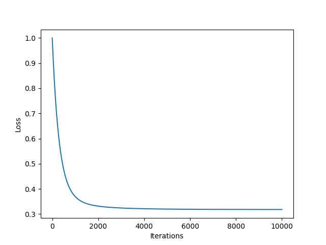

# Housing_Price_Prediction
This project implements a linear regression machine learning model to predict housing prices based on various features. The model is trained on a dataset containing information about different properties and their corresponding prices.

## Overview

The goal of this project is to develop a predictive model that can accurately estimate the price of a house given its features. This can be useful for real estate agents, homeowners, and investors to make informed decisions about buying and selling properties.

## Dataset

The dataset used for training and testing the model is provided in the `Housing.csv` file. It contains the following features:

- `mainroad`: Whether the property is located on the main road (binary: yes/no)
- `guestroom`: Whether the property has a guest room (binary: yes/no)
- `basement`: Whether the property has a basement (binary: yes/no)
- `hotwaterheating`: Whether the property has hot water heating (binary: yes/no)
- `airconditioning`: Whether the property has air conditioning (binary: yes/no)
- `prefarea`: Whether the property is in a preferred area (binary: yes/no)
- `furnishingstatus`: Furnishing status of the property (categorical: furnished, semifurnished, unfurnished)
- Other numerical features such as area, bedrooms, bathrooms, etc.

## Model Training

The model is trained using linear regression to learn the relationship between the input features and the target variable (price). Before training, the dataset is preprocessed, including one-hot encoding categorical variables and scaling numerical features using standard scaling.

## Usage

To use the model:

1. Install the necessary Python packages (Pandas, NumPy, Matplotlib).
2. Clone the repository and navigate to the project directory.
3. Run the `housing_price_prediction.py` script to train and evaluate the model.
4. Use the trained model to make predictions on new data.

## Results

